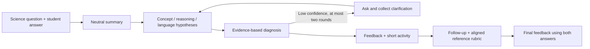

# Diagnostic Tutor

A Python CLI prototype that uses structured LLM hypotheses to interpret short science answers, give targeted feedback, and ask a follow-up question. This is a learning project applying concepts from Antonio Gullí's *Agentic Design Patterns* to an instructional workflow.

[Implementation notes](./Chapter%201/readme.md) · [Synthetic evaluation cases](./evals/cases.json) · [Evaluation protocol](./evals/README.md) · [Katherine's portfolio](https://katherinexu.me)

## What it does

Instead of generating one undifferentiated tutoring response, the tool separates observation, possible explanations, diagnosis, feedback, and a follow-up check. Intermediate hypotheses and reference rubrics use Pydantic schemas, making decisions inspectable.



The current CLI produces feedback rather than a pass/fail learning assessment. Model-reported confidence is a routing signal, not a calibrated probability.

## Example

**Question:** A metal spoon and a wooden spoon have been in the same room all day. Why does metal feel colder?

**Student answer:** “Metal has a lower temperature because metals are naturally cold.”

An appropriate response would distinguish temperature from heat transfer, point to the student's claim, and ask what a thermometer would show. A short activity could compare metal and wood, then explain the direction of heat flow.

This is an illustrative intended interaction, not a recorded model result or evidence of learning gains. See the evaluation set for references and failure cases, including correct, ambiguous, and “I don't know” answers.

## Run locally

Use Python **3.11 or 3.12**. Dependencies, including transitive packages, are pinned in `requirements.txt`.

```bash
git clone https://github.com/qxh2001/Agentic-Design-Patterns.git
cd Agentic-Design-Patterns
python3 -m venv .venv
source .venv/bin/activate
python -m pip install -r requirements.txt
export OPENAI_API_KEY='your-own-key'
python 'Chapter 1/Langchain.py'
```

The CLI reads environment variables from your shell; it does not automatically load `.env.example`. Set `OPENAI_MODEL` to select another compatible model. The default remains `gpt-4o-mini`.

Choose a topic-generated question or enter your own. Provide an initial answer, answer any clarification prompts, and optionally answer the follow-up. Live sessions make multiple OpenAI API calls and incur usage charges. Use synthetic examples; do not enter identifiable student records.

## Verification and evaluation

```bash
# No real API key or paid model calls required.
python -m unittest discover -s tests -v
python evals/run.py
```

GitHub Actions runs offline checks on Python 3.11 and 3.12. The tests cover uncertainty routing, collecting clarification answers, matching a follow-up to its rubric, retaining both answers, and conservative service-failure fallbacks.

For an explicit paid evaluation run:

```bash
python evals/run.py --live --limit 1
```

The runner records outputs, model, latency, and structural checks. Follow the [human-review rubric](./evals/README.md) to assess scientific correctness and instructional usefulness. Structural checks do not establish tutoring effectiveness, diagnosis accuracy, or improved student learning. No live evaluation scores are claimed.

## Repository map

| Path | Purpose |
| --- | --- |
| `Chapter 1/Langchain.py` | Prompts, typed state, graph, and interactive CLI |
| `Chapter 1/readme.md` | Detailed design and node notes |
| `requirements.in` / `requirements.txt` | Direct dependency constraints and pinned environment |
| `tests/` | Offline regression checks |
| `evals/` | Synthetic cases, opt-in runner, and human-review protocol |

## Limits

This is an instructional prototype, not an autonomous teacher or a validated educational intervention. The system can misdiagnose an answer or generate incorrect feedback. Human review is needed, especially for correct answers, weak evidence, and follow-up questions. When post-feedback generation fails, the fallback explicitly says no assessment was completed.

## License

[MIT](./LICENSE). The referenced book provides learning context; this repository is not an official companion project.
